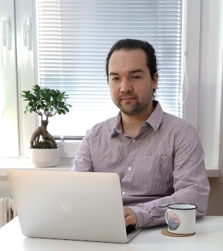
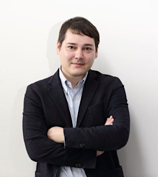
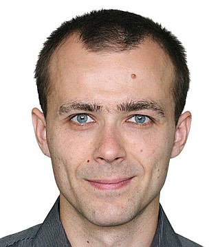

  

# O&nbsp;Java Akademii

## Představení kurzu

Cíl kurzu:

> Posunout se ve své programátorské kariéře z&nbsp;úplného začátečníka tak, aby sis mohl(a) troufnout na pozici juniorního programátora. 

Nebude to ale zadarmo &mdash; určitě totiž nebude stačit si odsedět samotnou lekci, ale budeš si muset:

- projít si materiály pro samostudium,

- opakovat a procvičovat probranou látku,

- pracovat na projektech,

- **ptát se, když ti něco nepůjde**. 

> Čtvrt hodiny tomu věnuj sám. Když to stále nejde, zeptej se!

Během dvanácti tříhodinových lekcí si postupně od úplných základů projdeme tvorbu programů v&nbsp;Javě. Zároveň si vše ukážeme i&nbsp;na příkladech, seznámíme se s&nbsp;nástroji, které se při vývoji aplikací bežně používají, projdeme si spolu celý vývojový cyklus aplikace. Ukážeme si, jak se testuje a&nbsp;všechny tyto nově nabyté znalosti nakonec dostanete šanci uvést do praxe, když si na projektu vyzkoušíš, jak se Ti podařilo učivo zvládnout.

---

## Představení lektorů

Na tomto kurzu se vám budou věnovat tři lektoři. Prvními šesti lekcemi vás provede [Martin](#Martin Šimůnek), ve zbytku lekcí se budou střídat [Marek](#marek-nedbal) a&nbsp;[Lukáš](#lukas-horak). Na Slacku nás najdete všechny tři.

### Marek Nedbal

 

- Živím se jako software engineer a krom krátkého extempore na začátku mé programátorské kariéry programuji již šestým rokem právě v Javě - momentálně pro společnost, o které v rámci Java kurzu ještě nekolikrát uslyšíte - <b>Oracle</b>

- Učení je mým koníčkem, který jsem objevil před rokem a máloco mě potěší tak, jako radost studenta, když ho drobnými radami doštouchám k tomu, aby si na řešení problému, na kterém se zasekl, přišel skoro sám

### Lukáš Horák

  

- V&nbsp;současné době pracuji jako consultant ve společnosti Adastra, ale s&nbsp;programováním jsem začal již před dlouhou dobou na základní škole. Měl jsem šteští, že díky práci jsem mohl pracovat v různých kulturách a setkat se s množštvím zajímavých lidí, od kterých jsem se sám mohl hodně naučit. Nyní je idealní příležitost znalosti předat dalším lidem a idealně nadchnout nové studenty.

### Martin Šimůnek

 

- Vystudoval jsem softwarové inženýrství na FEL ČVUT v&nbsp;Praze, ale také bakalářský obor Učitelství odborných předmětů. 

- Od roku 2006 působím jako středoškolský učitel a&nbsp;učím žáky zvládat programování, operační systémy, sítě a&nbsp;další IT předměty na oboru Informační technologie v&nbsp;rámci Obchodní akademie Uherské Hradiště.

- Budu se vám věnovat v&nbsp;prvních 6&nbsp;lekcích a&nbsp;mým úkolem bude provést vás úplnými začátky.

---

## Struktura lekce

Návrh:

1. Obvykle dostanete základní materiál k&nbsp;samostudiu.
	- Nejspíš to bude úvodní teorie &mdash; tu si můžeš přečíst sám, bylo by plýtvání časem, abychom Ti ji předčítali v&nbsp;hodině.

2. Samotná hodina bude obvykle rozdělena na tři části.
	- Nejčastěji cca pro 50&nbsp;minutách, mezi nimi vždy cca 10&nbsp;minut pauza.
	- Průběh hodiny vždy nahráváme, takže se k&nbsp;obsahu můžeš vrátit. 
	- Doporučujeme na hodiny chodit a&nbsp;záznam využít spíš pro osvěžení věcí, které Ti vypadly, nebo si je nepamatuješ přesně.

3. Na konci lekce bude úkol nebo úkoly.
	- Na úkolech si vyzkoušíš, jestli jsi učivo zvládl. A&nbsp;třeba Tě přivedou na správný dotaz, který jsi zapomněl položit.

4. Pro individuální dotazy bude určena konzultace.
	- Samozřejmě se můžeš ptát přímo v&nbsp;hodině. Ale někdy se stane, že s&nbsp;nějakou drobností nechceš hodinu zdržovat.
	- Někdy se chceš také zeptat něco nad rámec, co by třeba hodinu zdrželo a&nbsp;zajímá speciálně Tebe.
	- A&nbsp;na některé dotazy přijdeš až dodatečně po hodině, třeba při psaní úkolů.
	- I&nbsp;konzultace budeme nahrávat a&nbsp;budeš je mít k&nbsp;dispozici.
	- Je na Tobě, jestli chceš konzultace využívat, nebo jsou pro Tebe zbytečné. Konzultace jsou prostor pro dotazy navíc. Obvykle je využijí úplní začátečníci, abychom jim pomohli v&nbsp;začátcích, nebo pak pokročilejší, kteří se chtějí ptát něco navíc.

Souhlasíš? ;)

---

## Jak klást dotazy

- **Zapni si mikrofon a&nbsp;prostě se zeptej ;)**

- Zvedni ruku pomocí ikonky

- Napiš zprávu do Slacku

---

## Jak se učit
Je samozřejmě jen na vás, jak s&nbsp;Java Akademií naložíte. Jste naši zákazníci!

Abychom společně dosáhli nejlepších výsledků, navrhujeme následující „pravidla“:
1. Ptej se hned, jak narazíš na problém!
	- Není důležité, jak „hloupý“ Ti tvůj problém připadá. Neexistují hloupé dotazy. Pokud ti něco není jasné, je dotaz vždycky na místě!
2. Sledování je zábavné, učíš se ale psaním!
	- Víme, že je příjemné si sednout a&nbsp;sledovat, jak to lektorovi krásně jde (nebo třeba někdy nejde).
	- Pokud to ale s&nbsp;učením myslíš vážně, musíš si věci zkoušet sám/sama!
	- Je to stejné jako s&nbsp;běháním maratonu. Můžeš si poslechnout pět videokurzů o&nbsp;tom, jaké boty používat, jak se připravovat, jakou výživu zvolit.
	- A&nbsp;skutečně, najdeš lidi, kteří Ti budou hodiny zasvěceně vyprávět, jak se připravit na maraton. Ale až se postavíš na start, rozhoduje počet naběhaných kilometrů!
	- Je jen na Tobě, jestli se chcete stát „zdatným teoretikem“, nebo se skutečně naučit kódovat!
3. Nevyhovuje Ti něco? Řekni to!
	- Jsme tady pro Tebe. Neboj se říci si, co bys chtěl(a), nebo co by Ti pomohlo.
	- Věnovali jsme přípravě hodně času, ale neznáme Tě a&nbsp;Tvoje potřeby tak, jako se znáš Ty. Když nám dáš vědět, budeme se snažit akademii přizpůsobit Tvým potřebám a&nbsp;Tvému tempu. 
	- Navíc nám tím pomůžeš lépe pochopit, co účastníci akademie potřebují!

---

## Zdroje
 - [Stránka Java akademie na learn.engeto.com](https://learn.engeto.com/)
 - [On-line kurz Java#1](https://learn.engeto.com/cs/kurz/java-1-uvod-do-programovani/lekce)

---

[Zpět na přehled akademie](https://github.com/ENGETO-Java-Akademie-2021-07-12/intro)